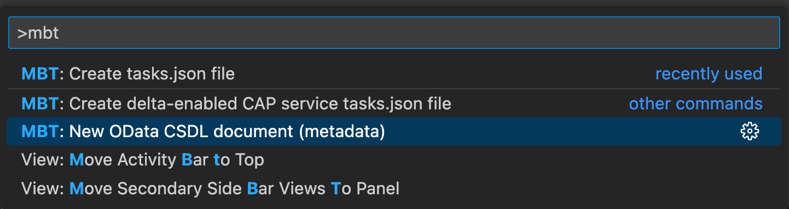
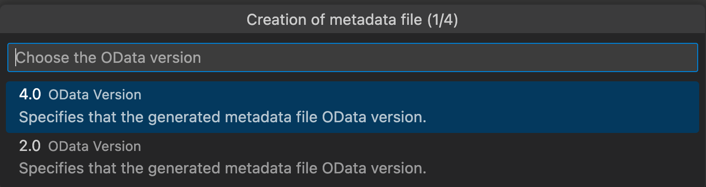
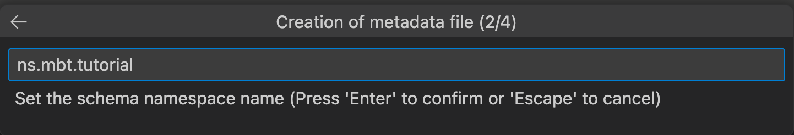
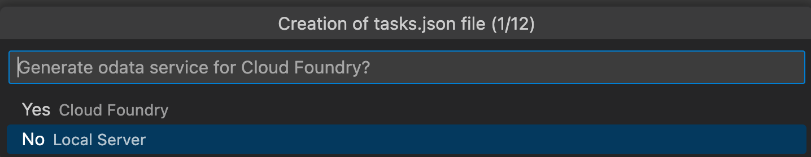
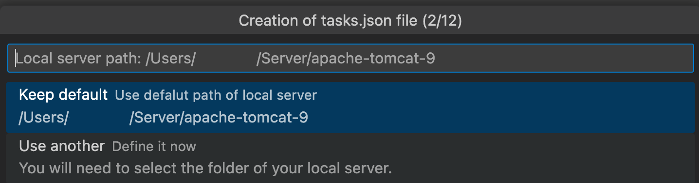
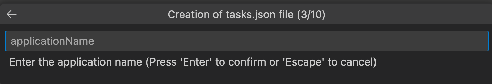
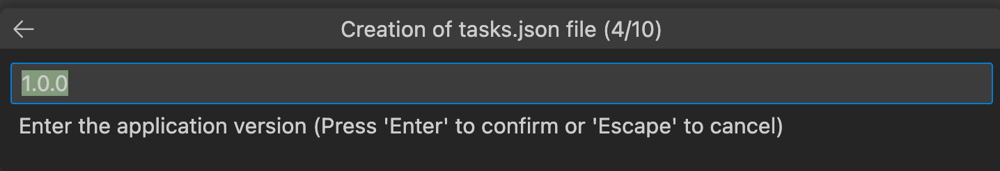
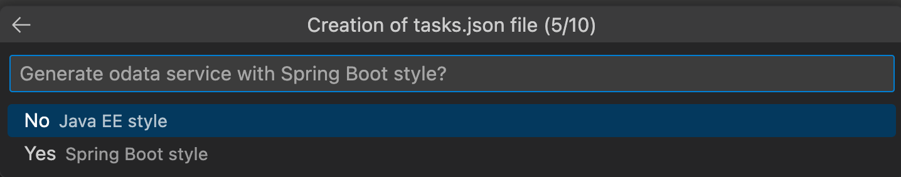
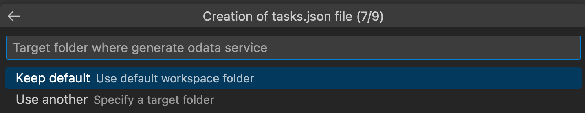

# SAPBTP_MBT_Basic

Tutorial for setting up a Mobile Backend Tool (MBT) project and create a first OData Service including a remote, cached data source.

## Prerequisites

In order to work through this tutorial you need to locally install some tools:

1. Visual Studio Code
2. Within VS Code, you need to install the extension SAP Mobile Backend Tools (SAPSE.vsc-extension-mbt)
3. A Java JDK, preferably SAP Machine JDK
4. Maven
5. Tomcat (min version) 9.0

## Task 1 - Project Setup

In this task we will create a project completely from scratch.
Open a terminal and follow these steps:

```zsh
    mkdir MBTProject
    cd MBTProject
```

Open this freshly created folder in VSCode now.
Use the Command Palette to create a new CSDL file with the `MBT: New OData CSDL Document` command.
You will now be prompted for some input. Choose OData version 4. MBT supports generation of both versions, provide namespace and other inputs and eventually choose a file name as depicted here:







The freshly created CSDL file will throw an error as the Entity Container is empty. Copy the following content into the CSDL file to get rid of this error message.

```xml
<?xml version="1.0" encoding="utf-8"?>
<edmx:Edmx xmlns:edmx="http://docs.oasis-open.org/odata/ns/edmx"
    xmlns:xsi="http://www.w3.org/2001/XMLSchema-instance" Version="4.0"
    xsi:schemaLocation="http://docs.oasis-open.org/odata/ns/edmx http://docs.oasis-open.org/odata/odata/v4.0/os/schemas/edmx.xsd
                        http://docs.oasis-open.org/odata/ns/edm http://docs.oasis-open.org/odata/odata/v4.0/os/schemas/edm.xsd">
    <edmx:Reference
        Uri="https://oasis-tcs.github.io/odata-vocabularies/vocabularies/Org.OData.Core.V1.xml">
        <edmx:Include Namespace="Org.OData.Core.V1" Alias="Core" />
    </edmx:Reference>
    <edmx:Reference
        Uri="https://oasis-tcs.github.io/odata-vocabularies/vocabularies/Org.OData.Validation.V1.xml">
        <edmx:Include Namespace="Org.OData.Validation.V1" Alias="Validation" />
    </edmx:Reference>
    <edmx:DataServices>
        <Schema xmlns="http://docs.oasis-open.org/odata/ns/edm" Namespace="ns.mbt.tutorial"
            Alias="Self">
            <EntityType Name="Customer">
                <Annotation Term="Core.Description" String="Customer entity type"/>
                <Key>
                    <PropertyRef Name="CustomerID" />
                </Key>
                <Property Name="CustomerID" Type="Edm.Int64" Nullable="false">
                    <Annotation Term="Core.Description" String="Customer primary key"/>
                </Property>
                <Property Name="Name" Type="Edm.String" MaxLength="100" Nullable="false"/>
                <Property Name="HomeAddress" Type="Edm.String" MaxLength="100" Nullable="false"/>
                <Property Name="WorkAddress" Type="Edm.String" MaxLength="100" Nullable="true"/>
                <Property Name="PlaceOfWork" Type="Edm.String" MaxLength="100" Nullable="false"/>
                <Property Name="DateOfBirth" Type="Edm.Date" Nullable="false">
                    <Annotation Term="Core.Immutable"/>
                </Property>
            </EntityType>
            <EntityContainer Name="Ns_mbt_tutorialService">
                <EntitySet Name="Customers" EntityType="Self.Customer">
                    <Annotation Term="Core.Description" String="Customers entity set"/>
                </EntitySet>
            </EntityContainer>    
        </Schema>
    </edmx:DataServices>
</edmx:Edmx>
```

Let's discuss what we see here.

First, notice the Reference tags. These references enable the mix-in of different features into our service metadata description. You see `Org.OData.Core.V1` and `Org.ODatatt.Validation.V1`. Later on, we will add more annotations. These meta information enable MBT to customize the code and asset generation.

Then, we see a "Schema" tag including our first entity (EntityType) named "Customer". Besides the Property tags you can also see that one Property  is marked as the "Key".
Each Property contains a Name, Type and additional elements as needed. We do not use Referential Constraints in this tutorial.

The last part of the service model is the EntityContainer. Here all defined entities - in our case, just the Customer - are put into a set and annotated with a description.

In the next part, we will generate our first service implementation and test the service.

## Task 2 - Generating the task.json

With our service model prepared, we will now create a task.json to define how the generator should translate our definition into code.

In VS Codes Command Palette, choose MBT: Create task.json file.

You will be prompted for some input. You can basically choose whatever fits your needs and it is pretty self-explanatory. Anyhow, for this tutorial we keep most default and basic inputs as follows:













In the last step you need to choose the mbttutorial.csdl.xml file we created in Task 1 and confirm.

As a result, you will find a task.json file in your .vscode folder.
Take a moment an examine the file in VS Code. You will find various new tasks that can now be executed. Many generation options are based on the input we just provided. You can change these input anytime if needed. For instance, when you moved your Tomcat installation location or you want to enable generation for another database.

Anyhow, most important task is the csdl-to-war. This tasks invokes a cli tool that was installed as part of the VS Code plugin for MBT. It takes your csdl file as input and generates a complete service implementation out of it. So, let do this.

## Task 3 - Generating code

From the Command Palette choose "Tasks: Run task" and choose "csdl-to-war"

MBT will now generate a Java EE project into your target directory, then downloads all the decencies, compiles your project starts your Tomcat in order to run it.

As you can see in your Explorer view, you know have some new folders, such as "src", "logs", "sql" and some more.

Let's examine what has been generated under "sql". Open the file `mbttutorial_1_0.sql`.

```sql
-- generated by csdl-to-sql for target h2 from mbttutorial.csdl.xml

create sequence "mbttutorial_xs_data_metrics_1_0_id_seq" start with 1 increment by 1 nocache;

create table "mbttutorial_xs_data_metrics_1_0"
(
    "id" bigint not null,
    "start" timestamp not null,
    "period" decimal(20,6) not null,
    "process" varchar(400) not null,
    "tenant" varchar(800) null,
    "provider" varchar(400) not null,
    "component" varchar(800) not null,
    "metric" varchar(400) not null,
    "unit" varchar(200) not null,
    "count" bigint null,
    "sum" bigint null,
    "average" decimal(25,2) null,
    "minimum" bigint null,
    "maximum" bigint null,
    primary key ("id")
);

create sequence "mbttutorial_Customers_1_0_id_seq" start with 1 increment by 1 nocache;

create table "mbttutorial_Customers_1_0"
(
    "CustomerID" bigint not null,
    "Name" varchar(400) not null,
    "HomeAddress" varchar(400) not null,
    "WorkAddress" varchar(400) null,
    "PlaceOfWork" varchar(400) not null,
    "DateOfBirth" date not null,
    "row_version" bigint not null,
    primary key ("CustomerID")
);

create table "mbttutorial_xs_repeatability_log_1_0"
(
    "CreationTime" timestamp not null,
    "ResponseStatus" smallint not null,
    "ClientID" varbinary(100) not null,
    "RequestID" varbinary(100) not null,
    "ContentID" varbinary(100) not null,
    "ResponseHeaders" varchar(4000) not null,
    "ResponseData1" varbinary(2000) null,
    "ResponseData2" blob null,
    primary key ("RequestID", "ContentID")
);

create index "mbttutorial_xs_repeatability_log_1_0_client_id_index" on "mbttutorial_xs_repeatability_log_1_0" ("ClientID");

create index "mbttutorial_xs_repeatability_log_1_0_creation_time_index" on "mbttutorial_xs_repeatability_log_1_0" ("CreationTime");
```

As you can see, the code generator did generate more tables than just your customer table. Also your customer table is actually called "mbttutorial_Customers_1_0". It follows a naming convention: `[APPLICATIONNAME_ENTITYNAME_MAJORVERSION_MINORVERSION]`. Apparently, schema versioning is one of the features. We will not discuss this in detail, but it is well documented.

Also interesting is the table "mbttutorial_xs_data_metrics_1_0". This table contains metrics, that will collect metering information during runtime of your service and provides usage analysis and indications for performance optimizations in production.

There are other tables, which are internally being used to provide additional features. The more features we add to our CSDL via annotations, more tables will automatically appear here. Most often, you do not need to care about these and only concentrate with your entity related tables.

Under `/src/main/java` you can find the generated source code. For each entity you have a handler and listener in the respective folder. For your Customer entity you got a `CustomerHandler.java` and a `CustomerListener.java` in the respective packages.

In the `CustomerListener.java`, you will find important methods, such as

```java
public void beforeSave(EntityValue entityValue)
```

In this method, you can provide your custom code that will be executed whenever a Customer record will be created or updated. There are other methods to let you customize the service behavior.

The service should run locally on <http://localhost:8080>. So let us test the service now.

And please ignore the license check in the terminal. During development, MBT is license free. For production through, you need a license.

## Task 4 - Test the Service

Open your browser and navigate to <http://localhost:8080>. You will see service description of your service providing you the information that there is collection called "Customer". According to the OData spec, you can also retrieve the full metadata of your service by browsing to <http://localhost:8080/$metadata>.

Now, navigate to your Customer collection by visiting <http://localhost:8080/Customers>. Note, that even though we named our entity "Customer", the service is using "Customers". This is because of the EntitySet. The output may surprise you as well, as there is suddenly an empty HTML table with the Customer attributes as columns.

The service understands, that when being accessed through a browser (User Agent Header/Accept), it will provide an HTML output. If you choose to use curl (or other tools), you will get plain OData as expected.

Let's try this on the Terminal. Open a new Terminal and try `curl http://localhost:8080` and it returns

```json
 {"@odata.context":"http://localhost:8080/$metadata#Customers","@odata.type":"#Collection(ns.mbt.tutorial.Customer)","value":[]}
```

You can ask the service to provide JSON format in the browser as well. Just use `http://localhost:8080/Customers?$format=json`.

The service can't provide any data, as we did not provide any. The database is empty at the moment.

Open the file `/src/main/resources/test-data/Customer.json` in VS Code. As you can see, the code generation already provided some test data and you can adapt as needed. The data here is only used while testing and will never be seen during production (see initial-data for data used in production). In order to see these information in our service, we need to tell the code, that it runs in test mode.

Start the Task: csdl-to-war-test using the Command Palette. You may need to select "Restart" task when prompted or close the previous csdl task, which still may run.

Now, back in the browser, you will see the file content of the `Customer.json`.

## Task 5 - Caching a Remote Service

Potential data sources for caching remote services are:

* HTTP
* RFC (via SAP Java Connector)
* SQL (relational databases through JDBC, using SOCKS5 on BTP only)
  
For this tutorial we will use a public HTTP source. Connection handling differs for all different connection types, but mapping follows the same concepts.

First, we need to make sure our Tomcat server knows which URL we want to access. Therefore, we create a properties file in `$CATALINA_HOME/conf/http` called mbttutorial.properties with the following content:

```ini
url=https://gorest.co.in/public/v2
user=
password=
```

User and Password will be used in case of Basic Authentication needed by the backend. You may need to create a /http directory first.

Next, we will create a new entity which represents the remote data:

```xml
 <EntityType Name="User">
    <Annotation Term="Core.Description" String="Remote user entity type"/>
    <Key>
        <PropertyRef Name="UserID" />
    </Key>
    <Property Name="UserID" Type="Edm.Int64" Nullable="false">
        <Annotation Term="Core.Description" String="User primary key"/>
    </Property>
    <Property Name="Name" Type="Edm.String" MaxLength="100" Nullable="false"/>
    <Property Name="Email" Type="Edm.String" MaxLength="100" Nullable="false"/>
</EntityType>
```

We put this entity directly beneath our existing `Customer`. At the moment, this would be a local entity - same as our Customer.
Next, we will add another vocabulary to our service definition in order to enable the caching feature. Let's add the needed Reference:

```xml
<edmx:Reference Uri="vocabularies/com.sap.cloud.server.odata.cache.v1.xml">
    <edmx:Include Namespace="com.sap.cloud.server.odata.cache.v1" Alias="Cache"/>
</edmx:Reference>
<edmx:Reference Uri="vocabularies/com.sap.cloud.server.odata.sql.v1.xml">
    <edmx:Include Namespace="com.sap.cloud.server.odata.sql.v1" Alias="SQL"/>
</edmx:Reference>
```

We added Cache for handling the cache parameter and SQL for allowing the tool to manage the tables, needed for caching.

This is documented here: [link](https://help.sap.com/doc/f53c64b93e5140918d676b927a3cd65b/Cloud/en-US/docs-en/guides/getting-started/mbt/conventions.html#cache-vocabulary)

Now, we can annotate the User entity to allow it to be cached. Add the following inside the User entity:

```xml
<Annotation Term="Cache.HttpDestination" String="mbttutorial"/>
<Annotation Term="Cache.RefreshBy" String="loadAll"/>
```

We also added a Cache behavior annotation, which defines that all the data should be retrieved from the backend and be loaded into the cache at once.
Next, we need to map the remote data source to your locally defined `User` entity. Therefore, we add the following to our entity:

```xml

<Annotation Term="Cache.LoadHandler">
    <Record>
        <PropertyValue Property="HttpRequest" String="GET /users"/>
        <PropertyValue Property="ResponseBody">
            <String>
                [
                    {
                        "id": "${entity.UserID}",
                        "name": "${entity.Name}",
                        "email": "${entity.Email}"
                    }
                ]
            </String>
        </PropertyValue>
    </Record>
</Annotation>

```

Lastly, we will add the remote `User` entity to our `EntitySet`. And enable the cache at the `EntitySet` level by adding the annotations for Caching and Tracking Changes.

```xml
<Annotation Term="SQL.CacheDatabase"/>
<Annotation Term="SQL.TrackChanges"/>
<EntitySet Name="Users" EntityType="Self.User">
    <Annotation Term="Core.Description" String="Remote User entity set"/>
</EntitySet>
```

Adding the Caching mechanism is a breaking change in terms of data base schema evolution. Usually, you would just need to increase the major version number in the task.json to handle this. As we are in a dev only scenario, we will just drop the database.

To do this, delete the H2 database under `$CATALINA_HOME` by removing all files starting with mbttutorial.

Now, start the local server by running the `csdl-to-war task` from the Command Palette. Open your browser and check the Collections of Customers and Users.
Users are actually retrieved from the backend and cached in the H2 database.

You can check the `mbttutorial.log` under /logs and see how the data is retrieved and stored in the local database.

This concludes this tutorial.

## Further Reading

* [MBT Documentation](https://help.sap.com/doc/f53c64b93e5140918d676b927a3cd65b/Cloud/en-US/docs-en/guides/getting-started/mbt/introduction.html)
